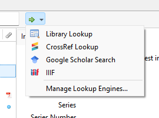

2022-12-23 ~ [code repo](https://pbinkley.github.io/zotero-iiif/)

This site is an attempt to meet the need to integrate [IIIF](https://iiif.org/)
manifest handling into [Zotero](https://www.zotero.org/). After some 
[experimentation](https://github.com/pbinkley/zotero-iiif/), this easy 
method seems to
be the best for now. It assumes you will store the URI of a IIIF
manifest in the 'Loc. in Archive' field of your Zotero records.

## Lookup Engine

To install the lookup engine, copy the JSON configuration into your
```engines.json```. Instructions can be found in the Zotero
documentation under
["Managing Lookup Engines"](https://www.zotero.org/support/locate#managing_lookup_engines). 
Restart Zotero.

```
{
	"_name": "IIIF",
	"_alias": "IIIF",
	"_description": "Render IIIF Manifest from 'Loc. in Archive'",
	"_icon": "https://iiif.io/assets/favicon.ico",
	"_hidden": false,
	"_urlTemplate": "https://pbinkley.github.io/zotero-iiif/mirador.html?manifest={z:archiveLocation}",
	"_urlParams": [],
	"_urlNamespaces": {
		"z": "http://www.zotero.org/namespaces/openSearch#",
		"": "http://a9.com/-/spec/opensearch/1.1/"
	},
	"_iconSourceURI": "https://iiif.io/assets/favicon.ico"
}
```

## Storing Manifest URIs

The lookup engine expects to find IIIF manifests in the "Loc. in
Archive" field. Simply copy the whole uri there. For items that have
a value in that field, there will be a "IIIF" link in the [locate
menu](https://www.zotero.org/support/locate) (the green arrow above 
the item display), like this:



## Customizing

If you would prefer to use a different field to store IIIF Manifests,
you can edit the lookup engine configuration (above): simply change
the ```_urlTemplate``` line, replacing ```z:archivelocation``` with
the key for the field you want to use. (See this [list of field
names](https://www.zotero.org/support/dev/client_coding/javascript_api/search_fields).)

Edit the ```_urlTemplate``` line if you would prefer to open the
manifest in some other IIIF viewer instance. For example, to use the
Universal Viewer demo instance you would use this template: 

```
https://uv-v4.netlify.app/#?manifest={z:archiveLocation}
```

## Future Work

It would be better if we could follow [Zotero's convention for new
fields](https://www.zotero.org/support/kb/item_types_and_fields#citing_fields_from_extra)
and store the manifest URI in the ```Extra``` field, with a prefix:

```
IIIF: <manifest uri>
```

I haven't found a way to extract such a value and use it in a lookup
engine configuration, but perhaps it's possible -- let me know!

